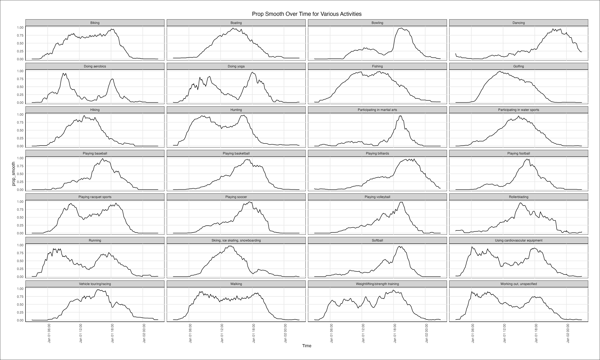
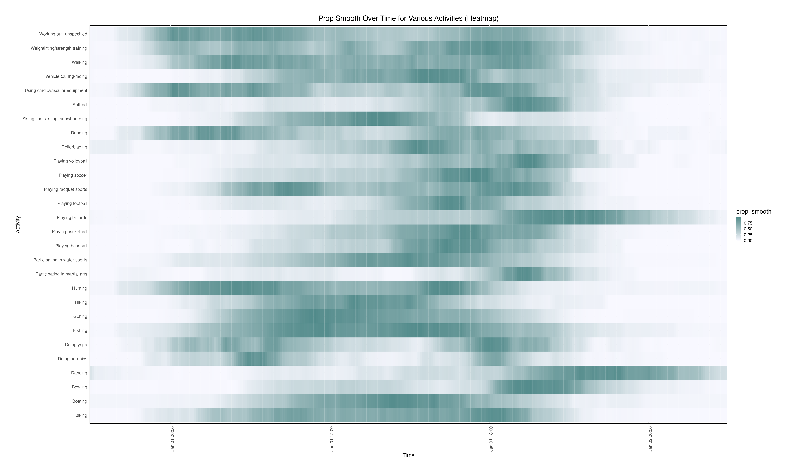
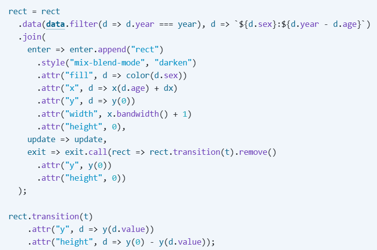

```{r setup, include=FALSE}
knitr::opts_chunk$set(echo = TRUE, message = FALSE, warning = FALSE, cache = FALSE)
```

# American Time Use Survey

## Part a

**Skim the data without visualizing it. Write three questions for follow-up analysis. Among these,at least one should compare multiple activities with one another, and at least one should compare time points within a single activity.**

1) Can we identify any significant or consistent pattern for variations in activity preference across the day?
2) Are there specific times when an activity peaks? 
3) Among all the activities, which one exhibits the highest peak engagement proportion? 

## Part b 

**Make a plot of prop_smooth over time for each activity. Justify your choice of visual encoding what questions does it help answer efficiently?**

```{r}
activities <- read.csv("https://github.com/krisrs1128/stat992_f23/raw/main/exercises/ps2/activity.csv")
```

```{r}
library(ggplot2)
plot_width <- 20
plot_height <- 12

activities$time <- as.POSIXct(activities$time)

p <- ggplot(activities, aes(x = time, y = prop_smooth)) +
  geom_line() +
  facet_wrap(~activity, ncol = 4) +
  labs(
    title = "Prop Smooth Over Time for Various Activities",
    x = "Time",
    y = "prop_smooth"
  ) +
  theme_minimal() +
  theme(
    axis.text.x = element_text(angle = 90, hjust = 1),
    plot.title = element_text(hjust = 0.5),
    plot.background = element_rect(fill = "white"),
    panel.background = element_rect(fill = "white"),
    panel.grid.major = element_line(color = "gray90"),
    panel.grid.minor = element_blank(),
    plot.margin = margin(1, 1, 1, 1, "cm"),
    strip.text = element_text(size = 8),
    axis.text = element_text(size = 8),
    axis.title = element_text(size = 10),
    axis.line = element_line(color = "black"),
    legend.text = element_text(size = 8),
    legend.key.size = unit(0.3, "cm"),
    legend.position = "none",
    strip.background = element_rect(fill = "lightgray"),
    strip.placement = "outside"
  )
ggsave("Prop_smooth.png", p, width = plot_width, height = plot_height)
```
I am attaching the image because the plot looks cramped here for some reason.


## Part c 

**Create an alternative visualization using a different encoding. For example, you may (but do not have to) use a heatmap, horizon [notes, package] or ridgeline [notes,package] plot. Compare the trade-offs involved between the two encodings. What questions are easier to answer using your visualization from (b), and which are easier to visualize using your visualization from (c)?**

```{r}
library(ggplot2)

activities$time <- as.POSIXct(activities$time)
plot_width <- 20
plot_height <- 12

p_heatmap <- ggplot(activities, aes(x = time, y = activity, fill = prop_smooth)) +
  geom_tile() +
  labs(
    title = "Prop Smooth Over Time for Various Activities (Heatmap)",
    x = "Time",
    y = "Activity",
    fill = "prop_smooth"
  ) +
  theme_minimal() +
  scale_fill_gradient(low = "ghostwhite", high = "darkslategray4") +  theme_minimal() +
  scale_x_datetime(expand = c(0,1)) +
  theme(
    axis.text.x = element_text(angle = 90, hjust = 1),
    plot.title = element_text(hjust = 0.5),
    plot.background = element_rect(fill = "white"),
    panel.background = element_rect(fill = "white"),
    panel.grid.major = element_line(color = "gray90"),
    panel.grid.minor = element_blank(),
    plot.margin = margin(1, 1, 1, 1, "cm"),
    legend.text = element_text(size = 8),
    axis.text = element_text(size = 8),
    axis.title = element_text(size = 10),
    axis.line = element_line(color = "black"),
    legend.key.size = unit(0.3, "cm"),
  )
#ggsave("Heatmap_Prop_smooth.png", p_heatmap, width = plot_width, height = plot_height)
```
I am attaching the image because the plot looks cramped here for some reason.


# Midwestern Power Plants

## Part a 

**Create a map of power plants that shows where plants are located, how they generate electricity (primary_fuel), and how much generation capacity they have (capacity_mw)**

```{r}
library(sf)
library(dplyr)
power_plants <- read_sf("https://raw.githubusercontent.com/krisrs1128/stat992_f23/main/exercises/ps2/power_plants.geojson") |>
mutate(
coords = st_coordinates(geometry),
longitude = coords[, 1],
latitude = coords[, 2]
)
```


```{r}
library(ggplot2)
library(sf)

basemap <- ggplot() +
  geom_blank(data = power_plants, aes(x = longitude, y = latitude)) +
  coord_fixed(xlim = c(-89.63490 - 10e5, -89.63490 + 10e5), ylim = c(42.90875 - 10e5, 42.90875 + 10e5), ratio = 1) +
  theme_void()

ggplot(data = power_plants) +
  geom_point(aes(x = longitude, y = latitude, color = primary_fuel, size = capacity_mw)) +
  scale_color_brewer(palette = "Set2", name = "Fuel Type") +
  labs(title = "Power Plants in the Upper Midwest", x = "Longitude", y = "Latitude") +
  theme_minimal() +
  theme(legend.position = "right") +
  guides(size = guide_legend(title = "Capacity (in MW)"))
```

## Part b

**Create an interactive version of the map from version (a) that allows users to brush a histogram to highlight plants with generation capacity within a certain range. One potential solution is shown here.**

```{r}
library(shiny)

ui <- fluidPage(
  h3("Mid-Western Power Plants"),
  fluidRow(
    column(6,
      h4("Brush over the plot to interact with the map"),
      plotOutput("stacked_histogram", brush = brushOpts("plot_brush", direction = "x"))
    ),
    column(6, plotOutput("map", height = 600)),
  )
)

server <- function(input, output, session) {
  all_data <- reactive({
    power_plants
  })

  selected_data <- reactiveVal(NULL)

  observeEvent(input$plot_brush, {
    brushed_data <- brushedPoints(power_plants, input$plot_brush)
    if (is.null(brushed_data)) {
      selected_data(NULL)
    } else {
      selected_data(brushed_data)
    }
  })

  common_color_scale <- scale_color_brewer(palette = "Set2", guide = guide_legend(title = "Type of fuel"))

  output$stacked_histogram <- renderPlot({
    ggplot(all_data(), aes(x = log_capacity, fill = primary_fuel)) +
      geom_histogram(alpha = 0.3) +
      scale_y_continuous(expand = c(0, 0, 0.1, 0)) +
      labs(
        x = "Capacity of the Power Plant in Mega Watts",
        y = "Number of Power Plants"
      ) +
      common_color_scale +
      theme(legend.position = "right")+
      theme_linedraw()
  })

  output$map <- renderPlot({
    if (!is.null(selected_data())) {
      ggplot(selected_data(), aes(x = longitude, y = latitude, color = primary_fuel, size = capacity_mw)) +
        geom_point() +
        labs(
          x = "Longitude",
          y = "Latitude"
        ) +
        common_color_scale +  
        theme_minimal()
    } else {
      ggplot(all_data(), aes(x = longitude, y = latitude, color = primary_fuel, size = capacity_mw)) +
        geom_point() +
        labs(
          x = "Longitude",
          y = "Latitude"
        ) +
        common_color_scale +
        theme_minimal()
    }
  }) 
}
shinyApp(ui, server)
```

## Part c

**Describe one strength and one limitation of the visualization generated in part (b). Consider one visual query for which it is poorly suited, and discuss (but do not implement) and alternative.**

Strength of the visualization:
- The interactive visualization can be used to explore the geographical distribution of power plants.
- It enables users to focus on specific subsets of the data.

Limitation of the visualization:
- Over plotting can occur on the map when displaying a large number of power plant.
- Individual points may become indistinguishable and cluttered.

Query: Identification of spatial clusters or patterns in power plant data for the Mid-West region.

Alternative:
- Implementing a heat map or density plot on the map to represent the density of power plants in different areas.
- Having interactivity with the individual points on the plot.

# Random Point Translations

## HTML Code
```{r eval=FALSE}
<!DOCTYPE html>
<html lang="en">
<head>
    <meta charset="UTF-8">
    <meta name="viewport" content="width=device-width, initial-scale=1.0">
    <script src="https://d3js.org/d3.v7.min.js"></script>
</head>
<body>
    <svg width="400" height="200"></svg>
    <script src="randomPoints.js"></script>
</body>
</html>
```

## Javascript Code
```{r eval=FALSE}
const svg = d3.select("svg");

function generateRandomData() {
  return d3.range(10).map(d3.randomUniform());
}

function updateCircles() {
  const newData = generateRandomData();

  svg
    .selectAll("circle")
    .data(newData)
    .transition()
    .duration(1000)
    .attr("cx", (d, i) => i * 40 + 40)
    .attr("cy", 100)
    .attr("r", (d) => d * 10) 
    .attr("fill", (d) => d3.interpolateRainbow(d));
}

const circles = svg
  .selectAll("circle")
  .data(generateRandomData())
  .enter()
  .append("circle")
  .attr("cx", (d, i) => i * 40 + 40)
  .attr("cy", 100)
  .attr("r", 10)
  .attr("fill", "black"); 

setInterval(updateCircles, 2000); 
```

# Bar Chart Translations

## HTML Code
```{r eval=FALSE}
<!DOCTYPE html>
<html>
<head>
    <link rel="stylesheet" type="text/css" href="styles.css">
</head>
<body>
    <div id="container">
        <button id="updateButton">Click</button>
        <div id="chart-container">
            <div id="chart"></div>
        </div>
    </div>
    <script src="https://d3js.org/d3.v6.min.js"></script>
    <script src="script.js"></script>
</body>
</html>

```

## CSS Code
```{r eval=FALSE}
body {
    display: flex;
    justify-content: flex-start;
    align-items: center;
    height: 100vh;
    margin: 0;
    padding: 0;
}

#container {
    display: flex;
    align-items: center;
    margin-left: 20px; 
}

#updateButton {
    margin-right: 20px; 
}

#chart-container {
    display: flex;
    flex-direction: column;
}

#updateButton {
    padding: 10px 20px; 
    border: 2px; 
    border-color: black;
    border-radius: 5px; 
    cursor: pointer;
}
```

## Javascript Code
```{r eval=FALSE}
let bar_ages = [];
const generator = d3.randomUniform(0, 500);
let id = 0;

const svg = d3.select("#chart")
    .append("svg")
    .attr("width", 1000)
    .attr("height", 400)
    
function createInitialChart() {
    svg.selectAll("rect")
        .data(bar_ages, (d) => d.id)
        .enter()
        .append("rect")
        .attr("x", (d, i) => i * 40)
        .attr("y", (d) => 200 - d.height)
        .attr("width", 80)
        .attr("height", (d) => d.height)
        .attr("fill", "black");
}
    
function updateChart() {
    bar_ages = bar_ages.map((d) => ({ id: d.id, age: d.age + 1, height: d.height }));
    bar_ages = bar_ages.filter((d) => d.age < 5);

    bar_ages.unshift({ age: 0, height: generator(), id: id });
    id += 1;

    const barWidth = 80;
    const barSpacing = 100;

    const bars = svg.selectAll("rect")
        .data(bar_ages, (d) => d.id);

    bars.transition()
        .duration(500)
        .attr("x", (d, i) => i * barSpacing)

    bars.enter()
        .append("rect")
        .attr("x", (d, i) => i * barSpacing)
        .attr("y", 200)
        .attr("width", barWidth)
        .attr("height", 0)
        .attr("fill", "black")
        .merge(bars)
        .transition()
        .duration(500)
        .attr("x", (d, i) => i * barSpacing)
        .attr("y", (d) => 200 - d.height)
        .attr("width", barWidth)
        .attr("height", (d) => d.height);

        bars.exit()
        .transition()
        .duration(500)
        .attr("x", (d, i) => i * barSpacing)
        .attr("y", 200)
        .attr("height", 0)
        .style("fill-opacity", 0) 
        .remove();
    
}
document.getElementById("updateButton").addEventListener("click", updateChart);
createInitialChart();
```
# Transition Taxonomy

## Part a 

**Pick any visualization from the New York Times Upshot, Washington Post Visual Stories, the BBC Interactives and Graphics, or the Guardian Interactives pages. Describe two transitions that it implements. Of the 7 transition types given above, which is each one most similar to? Explain your choice.**

I choose the "The Starlink network grows" animation from a New York Times article on "Elon Musk’s Unmatched Power in the Stars" (https://www.nytimes.com/interactive/2023/07/28/business/starlink.html)

The animation here shows how the satellite network expanded with each launch, over four years. Launches happen nearly every week, and about 60 satellites are released into orbit each time.

The two transitions in this animation:
1)The appearance of yellow dots with the increase in satellites. As new satellites are being launched and deployed over time, the animation transitions from one time frame to another showing the progression of the network's growth. 

- This transition is most similar to Timestep Transition.

Explanation: 
The Timestep transition represents a change of state of the data over time. In this case, the animation visually conveys the progression of the network's growth by showing how the number of satellites and their positions change as new launches occur.
  
2)The smooth rotation of the globe in the background. This transition changes the camera view or perspective associated with the fixed visualization. In this animation, as earth rotates, it alters the viewpoint showcasing different regions. 
  
- This transition is most similar to View Transformation Transition.

Explanation:
The View transformation transition is about changing the viewpoint or perspective while maintaining the same data. In this case, the animation rotates the globe in the background, showcasing different regions as the Earth rotates.

## Part b

**For any transition (which may or may not be one of those you chose in (a)), identify the types of graphical marks used to represent the data. How would you create this type of mark in SVG?**

In a Timestep Transition, the graphical marks represent the progression of data over time. In this animation, yellow dots represent satellites. These dots are added as new satellites are launched, and their positions change to show the network's growth.

Creating Satellite dots in SVG:
These dots representing satellites can be created using the 'circle' element.

Example: <circle cx="x" cy="y" r="radius" fill="color" />, where 'cx' and 'cy' represent the center coordinates of the circle, 'r' represents the radius and 'fill' sets the fill color of the circle.

## Part c

**To achieve the transition effect, how do you expect that the SVG elements would be modified / added / removed? Specifically, if elements are modified, what SVG attrs would be changed, and if elements are added or removed, how would the enter-exit-update pattern apply? You do not need to look at the code implementing the actual visualization, but you should give a plausible description of how the transition could be implemented in D3.**

The enter, update and enter pattern here can efficiently manage the graphical representation of satellite network's growth. 

- Enter(Addition): New 'circle' elements are added to represent the newly launched satellites. As you progress through the animation, during each new time step, new elements would be appended to the SVG canvas, and their attributes (e.g., cx, cy, r, fill) would be set based on the data for the newly launched satellites. 

- Update(Modification): The attributes of the existing 'circle' elements have to modified to represent the changes in the position. The attributes that would be updated include cx and cy to reflect the new positions, and other attributes like fill or r if there are changes in color or size.

- Exit(Removal): Removing 'circle' elements that are no longer relevant when there is lost communication for instance. 


# Icelandic Population Analysis

## Part a

**Explain how to read this visualization. What are two potential insights a reader could takeaway from this visualization?**

The visualization here represents the population data of Iceland over time and age, with different colors distinguishing between Male(blue) and Female(red) populations.
  - The X-axis represents the age groups. Each tick on the X-axis corresponds to a specific age group and are sorted and displayed in ascending order(towards left).
  - The Y-axis represents the population count. It is a measure of how many individuals are in each age and gender group.
  - The bars in the visualization represent population data corresponding to a specific age and gender group. The height of the bar indicates the population count for that specific age and gender group. 
  
Potential Insights:
  - The distribution of population across different age groups for both gender groups can be observed.
  - Insights into population growth, aging trends or specific gender-specific changes can be gained.This could help users examine how populations evolve over different years.
  - By observing the height of the bars, one can quickly identify age groups with high or low populations.This can be particularly valuable for detecting demographic disparities.
 
  
## Part b 

**The implementation uses the following data join,"rect = rect.data(data.filter(d => d.year === year), d =>`${d.sex}:${d.year - d.age}`). What does this code do? What purpose does it serve within the larger visualization?**

rect = rect
.data(data.filter(d => d.year === year), d => `${d.sex}:${d.year - d.age}`)

This line is binding data to the rectangle elements of the chart.
  - 'rect' elements represent the bars in the chart.
  - 'data.filter(d => d.year === year' is filtering the 'data' array to include only the data points where the 'year' matches with the input 'year'. This selects the data relevant to the specific year that has to be displayed on the chart.This filtered data will be bound to the selection of <rect> elements.
  - 'd => `${d.sex}:${d.year - d.age}`' is a function that combines the 'sex', 'year' and 'age' properties of each data point. The resulting key will look like 'Gender:BirthYear' 
  -The entire line binds the filtered data to the selection of <rect> elements (rect).
  
The primary purpose of this line is to bind the filtered data with the elements in the chart (the 'rect' elements). When the chart is updated using update(year), this line ensures that correct data points are associated with the corresponding bars in the chart. It plays a crucial role in creating a smooth, dynamic and interactive visualization. 


## Part c

**When the bars are entered at Age = 0, they seem to “pop up,” rather than simply being appended to the end of the bar chart. How is this effect implemented?**

The specific lines of code responsible for the 'pop up' effect:


  - In '.join()' method, bars are initially created with '.attr("y", d => y(0))' setting their initial position to 'y=0' and '.attr("height", 0)' setting their heigh to 0. This makes sure that the bars start with a height of 0 and then move upwards during transition.
  - The '.transition(t)' is used to animate the bars. '.attr("y", d => y(d.value))' updates the position of bars to their final position based on the data, and '.attr("height", d => y(0) - y(d.value))' updates the height to their final heights. 
This transition makes the bar "pop up" from their initial position to their final positions and heights. 

## Part d

**Suppose that you had comparable population-by-age data for two countries. What queries would be interesting to support? How would you generalize the current visualization’s design to support those queries?**

If there is comparable population by age data for two countries, it would be interesting to have a visualization that facilitates side-by-side comparison.

Query: How do the population age distributions of the two countries compare for a specific year?

Design Modification: Creating a side-by-side chart with each country's data being represented in separate section of the chart. Also, making sure that different colors are used to distinguish between the countries.

To generalize the current visualization for a side-by-side comparison of two countries' population-by-age data:
- Both X-axis and Y-axis should be extended to accommodate data for both countries.
- Modifying the bar chart to display side-by-side for each age group.
- Using distinct colors for each country for clear distinction.
- Adding labels, legend and tool tips for all the additional data considered.


