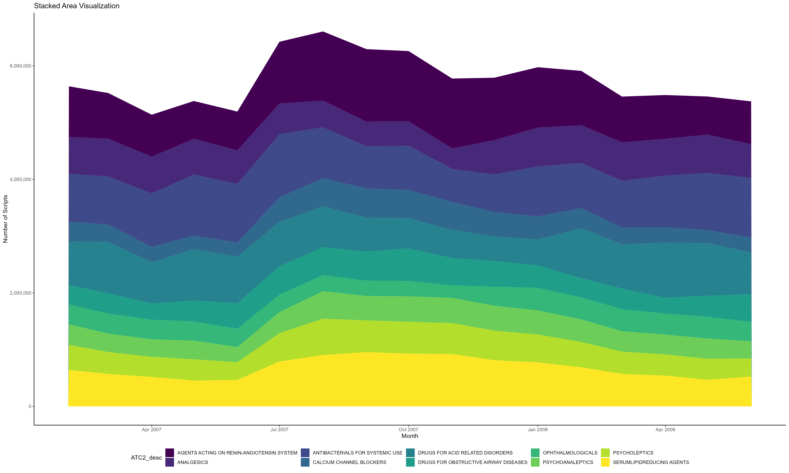
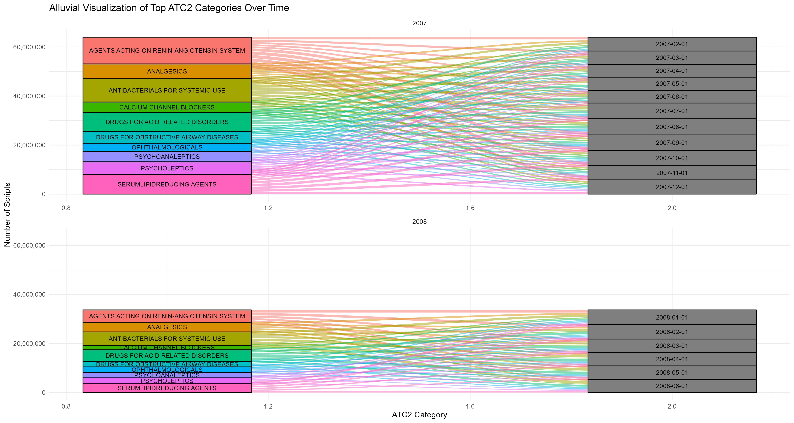
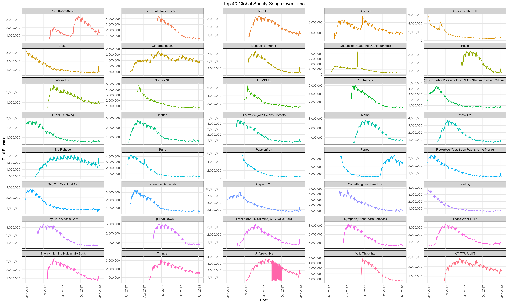

```{r setup, include=FALSE}
knitr::opts_chunk$set(echo = TRUE, message = FALSE, warning = FALSE, cache = FALSE)
```
# Glacial Lakes
```{r}
library(sf)
glacial_lakes <- read_sf("GL_3basins_2015.geojson")
```

## Part a
**How many lakes are in this data set?** 
```{r}
num_lakes <- nrow(glacial_lakes)
num_lakes
```
**What are the latitude / longitude coordinates of the largest lakes in each Sub-basin?**
```{r}
library(dplyr)

largest_lakes <- glacial_lakes %>%
  group_by(Sub_Basin) %>%
  slice(which.max(Area))

largest_lakes[, c("Sub_Basin", "Latitude", "Longitude")]
```

## Part b
**Plot the polygons associated with each of the lakes identified in step (a).**
```{r}
library(tmap)
tmap_mode("view")
tmap_options(unit = "km")
tm_shape(glacial_lakes) +
  tm_borders() +
  tm_facets(by = "Sub_Basin", free.scales = FALSE, ncol = 5) +
  tm_bubbles(size = "Area", col = "Area") +  
  tm_scale_bar(text.size = 0.5, position = c("right", "bottom")) +
  tm_layout(legend.outside = TRUE, inner.margins = c(0.2, 0.1, 0.2, 0.1))
```

## Part c
**Visualize all lakes with latitude between 28.2 and 28.4 and with longitude between 85.8 and 86.Optionally, add a basemap associated with each lake.**
```{r}
filtered_lakes <- glacial_lakes %>%
  filter(Latitude >= 28.2 & Latitude <= 28.4 & Longitude >= 85.8 & Longitude <= 86)
tmap_mode("view")
tm_shape(filtered_lakes) +
  tm_basemap() +
  tm_borders() +
  tm_bubbles(size = "Area", col = "Area") +
  tm_layout(legend.show = TRUE)
```

# Australian Pharmaceuticals II
```{r}
pbs_full <- read.csv("https://uwmadison.box.com/shared/static/fcy9q1uleqru7gcs287q903y0rcnw2a2.csv") %>%
  mutate(Month = as.Date(Month))

top_atcs <- pbs_full %>%
group_by(ATC2_desc) %>%
summarise(total = sum(Scripts)) %>%
slice_max(total, n = 10) %>%
pull(ATC2_desc)

pbs <- pbs_full %>%
filter(ATC2_desc %in% top_atcs, Month > "2007-01-01")
```

## Part a
**Implement a stacked area visualization of these data.**
```{r}
library(ggplot2)
library(scales)
library(viridis)

b <- ggplot(pbs, aes(x = Month, y = Scripts, fill = ATC2_desc)) +
  geom_area() +
  labs(title = "Stacked Area Visualization",
       x = "Month",
       y = "Number of Scripts") +
  theme_classic() +
  scale_y_continuous(labels = scales::comma)+
  scale_fill_viridis_d()+
  theme(legend.position = "bottom")

ggsave("stacked_area.png", b, width = 20, height =12)
```


## Part b
**Implement an alluvial visualization of these data.**
```{r}
library(ggplot2)
library(ggalluvial)
library(viridis)

pbs <- mutate(pbs, Year = lubridate::year(Month))

all <- ggplot(pbs, aes(axis1 = ATC2_desc, axis2 = Month, y = Scripts)) +
  geom_alluvium(aes(fill = ATC2_desc), width = 0.1) +
  geom_stratum(aes(fill = ATC2_desc)) +
  geom_text(stat = "stratum", aes(label = after_stat(stratum)), size = 3) +
  theme_minimal() +
  scale_y_continuous(labels = scales::comma) +
  theme(legend.position = "none") +
  labs(title = "Alluvial Visualization of Top ATC2 Categories Over Time", x = "ATC2 Category", y = "Number of Scripts") +
  facet_wrap(~Year, scales = "free_x", ncol = 1)

ggsave("alluvial_plot.png", all, width = 15, height = 8, units = "in")
```


## Part c
**Compare and contrast the strengths and weaknesses of these two visualization strategies. Which user queries are easier to answer using one approach vs. the other?**

Stacked Area Chart:
- Stacked area charts are effective in showing the total and relative contribution of multiple variables over time. 
- They make it easy to see the total and individual contributions. They are often straightforward to interpret.
- Not ideal when individual categories across different time points have to be compared.
- As more categories are added,there may be over plotting issues, making it challenging to distinguish between different areas.

Alluvial Visualization:
- Alluvial diagrams are particularly useful for showing the flow and transition between different categories over time.
- Comparison of the distribution of categories at different time points can be done. facilitating the analysis of changes over time.
- Can be complex, especially when large number of categories are considered.
- not suitable for representing categorical data. 

User Queries:
- Stack area charts are suitable for queries related to trend analysis. Users can easily compare the total size and relative proportions of different categories.
- Queries about how categories transition over time are well-suited for alluvial visualizations.They are effective for answering queries related to specific paths or sequence of events.

In conclusion, Stacked area charts are great for showing cumulative trends, while alluvial diagrams are more suitable for analyzing categorical transitions and paths over time.

# Spotify Time Series II
```{r}
library(tidyverse)

spotify_full <- read_csv("https://uwmadison.box.com/shared/static/xj4vupjbicw6c8tbhuynw0pll6yh1w0d.csv")

top_songs <- spotify_full %>%
  group_by(track_name) %>%
  summarise(total = sum(streams)) %>%
  slice_max(total, n = 40) %>%
  pull(track_name)

spotify <- spotify_full %>%
  filter(region == "global", track_name %in% top_songs)
```

## Part a
**Design and implement a line-based visualization of these data.**
```{r}

p <- ggplot(spotify, aes(x = date, y = streams, color = track_name)) +
  geom_line() +
  labs(title = "Top 40 Global Spotify Songs Over Time",
       x = "Date",
       y = "Total Streams") +
  theme_minimal() +
  scale_y_continuous(labels = scales::comma, expand = c(0.1, 0.1)) +  
  facet_wrap(~track_name, scales = "free_y", ncol = 5) +
  theme(
    plot.title = element_text(hjust = 0.5),
    plot.background = element_rect(fill = "white"),
    panel.background = element_rect(fill = "white"),
    panel.grid.major = element_line(color = "gray90"),
    panel.grid.minor = element_blank(),
    legend.position = "none",
    strip.background = element_rect(fill = "lightgray"),
    strip.placement = "outside",
    axis.text.x = element_text(angle = 90, hjust = 1),
    axis.title.y = element_text(angle = 90, vjust = 0.5)
  )

ggsave("spotify_line_plot.png", p, width = 20, height = 12)

```
I am attaching the image because the plot looks cramped here for some reason.


## Part b
**Design and implement a horizon plot visualization of these data.**
```{r}
library(ggHoriPlot)
library(ggplot2)
library(dplyr)

spotify_filtered <- spotify %>%
  filter(track_name %in% top_songs)

track_totals <- spotify_filtered %>%
  group_by(track_name) %>%
  summarise(total_streams = sum(streams)) %>%
  arrange(desc(total_streams))

cutpoints <- seq(0, 11381520, by = 1500000)

q <- spotify_filtered %>%
  ggplot() +
  geom_horizon(aes(x = date, y = streams, fill = after_stat(Cutpoints)), origin = 350, horizonscale = cutpoints) + 
  theme_minimal()+
  scale_fill_hcl(palette = 'RdBu') +
  facet_grid(reorder(track_name, -streams) ~ .) +
  theme(
    plot.background = element_rect(fill = "white"), 
    strip.text.y = element_text(angle = 0, margin = margin(t = 10)),
    axis.text.y = element_text(angle = 0, vjust = 0.5),
    axis.ticks.y = element_blank(),
    axis.ticks.x = element_blank(),
    legend.position = "bottom"
  ) 

ggsave("spotify_horizon_plot.png", q, width = 30, height = 20)
```
I am attaching the image because the plot looks cramped here for some reason.


## Part c
**Building from the static views from (a - b), propose, but do not implement, a visualization of this data set that makes use of dynamic queries. What would be the structure of interaction, and how would the display update when the user provides a cue? Explain how you would use one type of D3 selection or mouse event to implement this hypothetical interactivity.**

Structure of Interaction:
- Include a data range slider that allows users to filter the data based on a specific time interval.
- Display a time-series line chart showing the trend of various songs over time.

D3 Selection:
- D3 event listeners to observe the changed in the slider selection.
- d3.select() and d3.selectAll to select all the necessary elements.

Implementation Steps:
- A function has to be implemented that updates the charts based on the selection from the slider.

Example Implementation:

function updateChart(selectedSong, dateRange) {
  // Filter data based on selected song and date range
  var filteredData = spotify.filter(function(d) {
    // Implement filtering logic based on selectedSong and dateRange
  });

  // Update chart elements based on filteredData
  // ...

}

d3.select("#dateRangeSlider").on("input", function() {
  var currentDateRange = d3.event.target.value;
  updateChart(currentSelectedSong, currentDateRange);
});


# Calfresh Enrollment II
I discussed this problem with Niharika Chunduru.
```{r}
#Getting rid of the NA values in the enrollment column. 
df <- read.csv("calfresh-small.csv")
df_filtered <- df[!grepl('2021', df$date), ]
write.csv(df_filtered, 'calfresh_small_filtered.csv', row.names = FALSE)
```

```{r eval=FALSE}
<!DOCTYPE html>
<html>
  <head>
    <script src="https://d3js.org/d3.v7.min.js"></script>
    <script src="https://d3js.org/d3-selection-multi.v1.min.js"></script>
  </head>
  <body>
    <svg height=900 width=1200>
      <g id="lines"/>
      <g id="axes">
        <g id="x_axis"/>
        <g id="y_axis"/>
      </g>
      <g id="map"/>
    </svg>
  </body>
  <script src="calfresh-enrollment.js"></script>
</html>
```

```{r eval = FALSE}
const transitionDuration = 300;
const chartWidth = 600;
const chartHeight = 400;
const mapTranslation = 700;

let yExtent, yScale, county_data;

function make_scales(data, margin) {
  yExtent = d3.extent(data.map(d => d.calfresh));
  yScale = (yExtent[1] - yExtent[0]) / 100;

  return {
    x: d3.scaleTime()
      .domain(d3.extent(data.map(d => d.date)))
      .range([margin.left, chartWidth - margin.right]),
    y: d3.scaleLinear()
      .domain([yExtent[0] - yScale, yExtent[1] + yScale])
      .range([chartHeight - margin.bottom, margin.top]),
    fill: d3.scaleSequential(d3.interpolateBlues)
      .domain(d3.extent(data.map(d => d.calfresh)))
  };
}

function draw_axes(scales, margin) {
  let x_axis = d3.axisBottom(scales.x);
  d3.select("#x_axis")
    .attr("transform", `translate(0, ${chartHeight - margin.bottom})`)
    .call(x_axis);

  let y_axis = d3.axisLeft(scales.y);
  d3.select("#y_axis")
    .transition(transitionDuration)
    .ease(d3.easeLinear)
    .attr("transform", `translate(${margin.left}, 0)`)
    .call(y_axis);
}
function draw_lines(county_data, scales) {
  let path_generator = d3.line()
    .x(d => scales.x(d.date))
    .y(d => scales.y(d.calfresh))

  d3.select("#lines")
    .selectAll("path")
    .data([county_data]).enter()
    .append("path")
    .transition(300)
    .ease(d3.easeLinear)
    .attrs({
      d: path_generator,
      id: cd => cd.county,
      stroke: "#a8a8a8",
      "stroke-width": 3, 
      fill: 'none', 
      opacity: 0.9
    })
}

function generate_ts(data) {
  let margin = {top: 100, right: 10, bottom: 20, left: 50}

  let scales = make_scales(data, margin)
  draw_axes(scales, margin)
  draw_lines(data, scales)
}

function update_ts(map_data, calfresh_data) {
  county_data = calfresh_data.filter(d => d.county == map_data.properties.county)
  d3.select("#lines")
    .selectAll("path")
    .remove()
  generate_ts(county_data)

  d3.select("#map")
    .selectAll("path")
    .attr("stroke-width", d => d.properties.county == map_data.properties.county ? 4 : 0)
}

function generate_map(map_data, calfresh_data) {
  let width = chartWidth;
  let height = chartHeight;
  let proj = d3.geoMercator().fitSize([width, height], map_data)
  let path = d3.geoPath().projection(proj)

  let calfresh_county_means = calfresh_data.reduce((result, cd) => {
    if (!result[cd.county]) {
      result[cd.county] = { sum: 0, count: 0 };
    }
    result[cd.county].sum += cd.calfresh;
    result[cd.county].count += 1;
    return result;
  }, {})

  Object.values(calfresh_county_means).forEach((d) => d.mean = d.sum/d.count)

  let fillScale = d3.scaleSequential(d3.interpolateReds)
                    .domain(d3.extent(Object.values(calfresh_county_means).map(d => d.mean)))
                    
  d3.select("#map")
    .selectAll("path")
    .data(map_data.features).enter()
    .append("path")
    .attrs({
      d: path,
      fill: d => fillScale(calfresh_county_means[d.properties.county].mean),
      "stroke-width": 0,
      stroke: "#000",
      transform: `translate(${mapTranslation}, 0)`
    })
    .on("mouseover", (_, map_data) => update_ts(map_data, calfresh_data));
                
  }

function visualize([calfresh_data, map_data]) {
  let parseDate = d3.timeParse('%Y %b')
  calfresh_data.forEach((d) => {d.date = parseDate(d.date)})
  generate_ts(calfresh_data)
  generate_map(map_data, calfresh_data)
}


Promise.all([
  d3.csv("calfresh-small_filtered.csv", d3.autoType), 
  d3.json("ca-counties.geojson")
]).then(visualize)
```

# Temporal and Geospatial Commands
**For each of the commands below, explain what role it serves in temporal or spatial data visualization. Describe a specific (if hypothetical) situation within which you could imagine using the function.**

**a) geom_stream**
- used to create stream graphs, which visualize temporal data. Each stream represents a time series, and the height of the stream corresponds to the value of the time series at a given point.
-Hypothetical Situation:These plots can be used to visualize the popularity of each genre of music over time. Each stream in the graph could represent a genre and the flow would represent the changes in popularity.

**b) tm_lines**
-used for creating interactive and static maps.
- allows users to plot lines on map. 
-especially useful for visualizing spatial data where the relationship between different locations is being observed.
- Hypothetical Situation:Imagine you are visualizing the number of flights that fly from and to Madison per day. You could use "tm_line" to plot the paths that flights take on a map, with different colors representing different airlines.

**c) rast**
- used for working with pixelated data. 
- particularly useful for visualizing spatial data with continuous variation.
- Hypothetical Situation:Suppose you are visualizing the average temperature per day across Midwest. A raster plot where each pixel's color represents the temperature, providing a detailed visualization of temperature patterns.

**d) geom_horizon**
- used to create horizon plots.
- particularly useful when visualizing temporal data with multiple time series.
- horizon plots provide a compact representation of how data varies over time.
- Hypothetical Situation: Imagine visualizing the stock prices of multiple companies over an year. Each plot could represent the daily stock price of a particular company. Trends or variations of stock price over time can be observed.

# Visualization for Everyday Decisions

## Part a
**Describe one type of spatial or temporal data set (loosely defined) that you encounter in a nonacademic context. What visual encodings are used? Does it implement any interactivity?**

Example: Metro Transit System Map

Visual Encodings:
- Geographic layout: The dataset is a map representing the bus transportation system in the city. Different transit lines are represented in different colors and their paths are represented as lines or paths connecting different stops.
- Node Markers: Bus stops are often marked as nodes.
- Icons or symbols: Special icons are used to represent the major transfer points and key landmarks.

Interactivity:
- Zoom and Pan: Users can zoom in to see details of a specific area or zoom out to view the entire network.
- Real time updates: The app allows users to see the current location and arrival times of different buses.

## Part b
**What questions does the visualization help you answer? How easily can you arrive at an accurate answer?**

Questions Answered:
- Route Planning: Users can plan their journeys by identifying the optimal routes and connections.
- Accessibility: A city's accessibility can be evaluated by observing the density of transit stations.
- Real time information: Determining the current status and arrival times of different buses for time-sensitive travel decisions.

The representation can be effectively used for route planning and understanding the overall structure of the public transportation system. However, interpreting real-time information might require additional tools.

## Part c
**In the spirit of the re-imagined parking sign project, propose an alternative representation of these data (or an alternative way of interacting with the same representation). Why did you propose the design that you did? What advantages do you think it has?**

Design proposal-

Interactive Parking Restrictions Interface:
- Instead of a static map, an interactive interface can be used that display daily parking restrictions. 
- An additional feature can be included where users can check the restrictions for a different day, enhancing the overall user experience. 

Advantages:
- The interactive nature of the interface ensures clarity by presenting only the pertinent parking information for the selected day, reducing confusion and improving user understanding.
- The interactive interface can be customized for special occasions with unique parking regulations. Users can be alerted with messages ensuring they are well-informed ahead of time.


